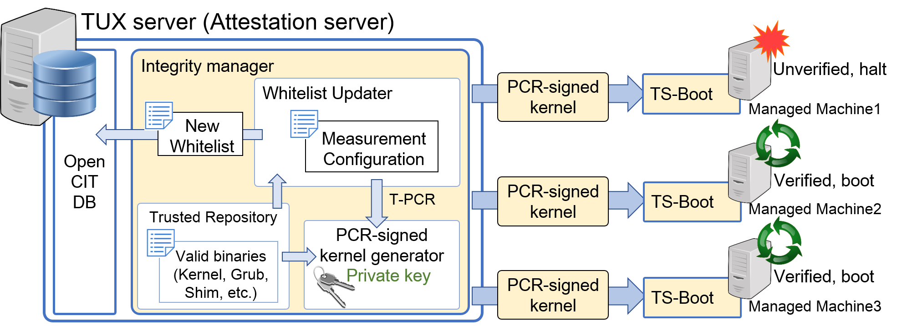

```bash
# 1.4 Architecure of TUX
 <center> </center>
### Read paper for deatils

# COMPONENTS
TUX is composed of three parts 
 - *Integrity Manger*: Integrity management and kernel update module.
 - *PCR signed kernel*:  Special kernel which is used during TS-boot’s integrity verification.
 - *TUX Secure boot*:  Combination of UEFI Secure boot, modified shim and modified grub, measures every binaries and commands executed during the booting process, including the grub commands and modules.

# HOW TO INSTALL
 We tested TUX using following environment. However, TS-boot can be used on any platform which runs Ubuntu 16.04 and may run on other versions as well.
>Build environment
>Ubuntu 16.04.5 LTS
>*Local machine which runned TS-boot
Dell Optiplex 7040M mini-computer
Ubuntu server 16.04 LTS x86
>*Remote attestation server
Gigabyte GT404-600-D70T
Ubuntu 14.04.5 LTS

## TS-boot: Grub, shim, keys, and how to sign.
### Grub
This build process is based upon: <https://help.ubuntu.com/community/UEFIBooting#Building_GRUB2_.28U.29EFI>. 
You may just run the following instructions.

Building grub2 requires the following programs to be installed (build dependencies):
<code>
sudo apt-get install bison libopts25 libselinux1-dev autogen m4 autoconf help2man libopts25-dev flex libfont-freetype-perl automake autotools-dev libfreetype6-dev texinfo
</code>

How to build for 64-bit (U)EFI:
<code>
./autogen.sh
export EFI_ARCH=x86_64
./configure --with-platform=efi --target=${EFI_ARCH} --program-prefix=""
make
</code>

How to build EFI application:
<code>
cd [grub2\_compiled\_source\_dir]/grub-core
../grub-mkimage -O ${EFI\_ARCH}-efi -d . -o grub.efi -p "" part\_gpt part\_msdos ntfs ntfscomp hfsplus fat ext2 normal chain boot configfile linux multiboot 
</code>

You may change output file name(grub.efi by default) and may add more modules behind multiboot.
After build, you must sign the EFI application. It will be explained later.

###shim
Building shim may need ssl library

How to build
<code>
./autogen.sh
./configure
make
</code>
this will generate Shim.efi. 
After build, you must sign the EFI application. It will be explained later as well.

###UEFI secure boot key install
This process is based upon: <https://wiki.gentoo.org/wiki/Sakaki%27s_EFI_Install_Guide/Configuring_Secure_Boot_under_OpenRC>.
You may look at it carefully to gain proper ways to install keys.
Following instruction might only work on Dell Optiplex 7040M mini-computer.
You may need to install efitools package.

>1. First make keys for yourselves.
>2. Try to read efi keys.
><code>
>efi-readvar
></code>
>3. Copy old keys.
><code>
>mkdir -p -v /etc/efikeys
>chmod -v 700 /etc/efikeys
>cd /etc/efikeys
>
>efi-readvar -v PK -o old_PK.esl
>efi-readvar -v KEK -o old_KEK.esl
>efi-readvar -v db -o old_db.esl
>efi-readvar -v dbx -o old_dbx.esl
></code>
>4. Delete all keys from the BIOS
>5. Reboot and do efi-readvar to check if the keys are all deleted
>6. Concatenate old and new keys
<code>
cat old_KEK.esl custom_KEK.esl > compound_KEK.esl
cat old_db.esl custom_db.esl > compound_db.esl
</code>
>7. Do following with exact order. Otherwise it will make a fault and you should re-delete keys and do it over.
<code>
efi-updatevar -e -f old_dbx.esl dbx
efi-updatevar -e -f compound_db.esl db
efi-updatevar -e -f compound_KEK.esl KEK
eif-updatevar -e -f old_PK.esl PK
//PK might not work...
</code>
>8. reboot and the keys will be installed. Check with efi-readvar.
